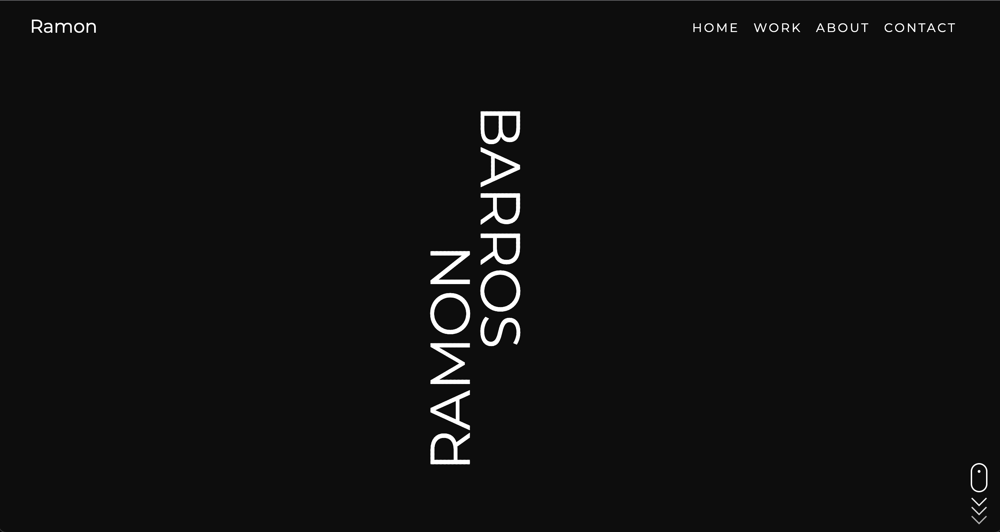

# Next.js Portfolio by Ramon Barros
> Next.js personal portfolio website.
> Live demo [_here_](https://nextjs-portfolio-plkiswcrh-ramonpbarros.vercel.app/). 

## Table of Contents
* [General Info](#general-information)
* [Technologies Used](#technologies-used)
* [Features](#features)
* [Screenshots](#screenshots)
* [Setup](#setup)
* [Usage](#usage)
* [Project Status](#project-status)
* [Room for Improvement](#room-for-improvement)
* [Acknowledgements](#acknowledgements)
* [Contact](#contact)
<!-- * [License](#license) -->


## General Information
- Basically a clean profile website where user can display most recent projects.
- Built with a more modern framework.

## Technologies Used
- Next.js
- Javascript
- Sass


## Features

- Mobile Responsive
- Animated features
- Clean design


## Screenshots


## Setup

```bash
npm install
# or
yarn install
```

## Usage
```bash
npm run dev
# or
yarn dev
```

`Open http://localhost:3000 with your browser to see the result.`


## Project Status
Project is: _in progress_.


## Room for Improvement

- Improvement to be done 1
- Improvement to be done 2

To do:
- Feature to be added 1
- Feature to be added 2


## Acknowledgements

- This project was inspired by most recent projects worked on using Next.js.

## Contact
Created by [@ramonpbarros](https://nextjs-portfolio-plkiswcrh-ramonpbarros.vercel.app/) - feel free to contact me!
